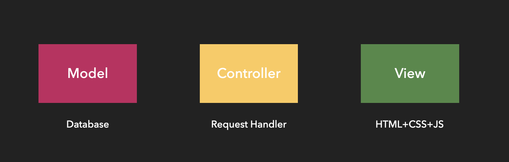
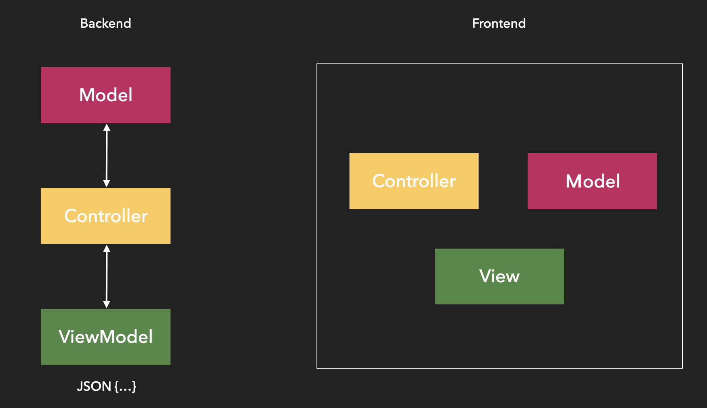
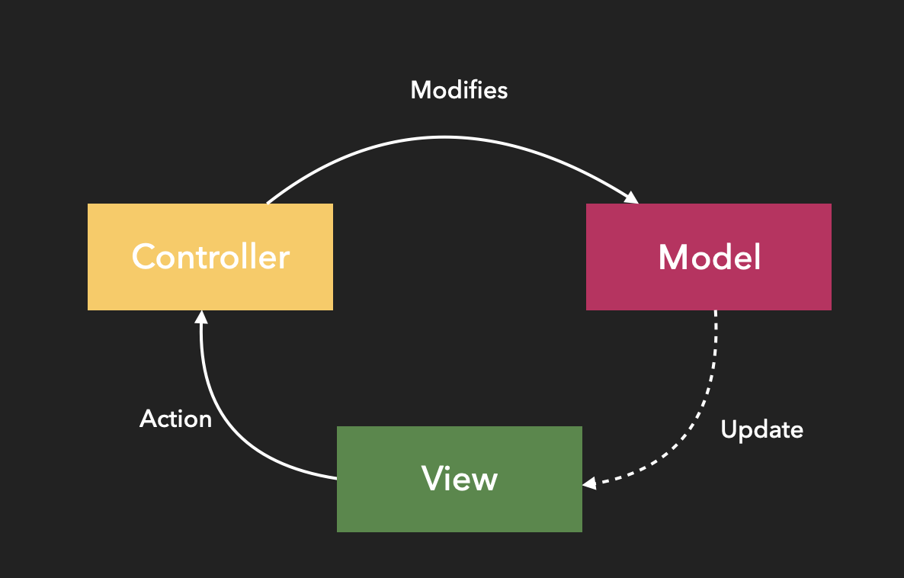
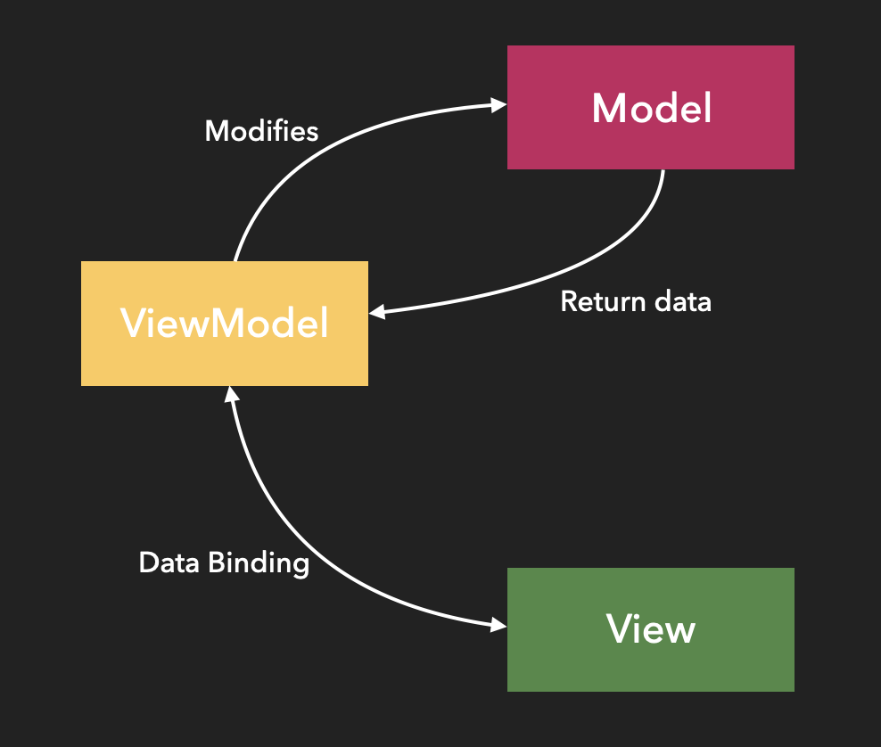
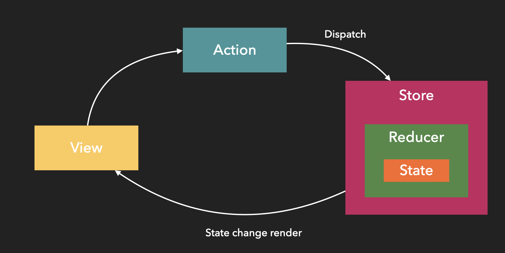
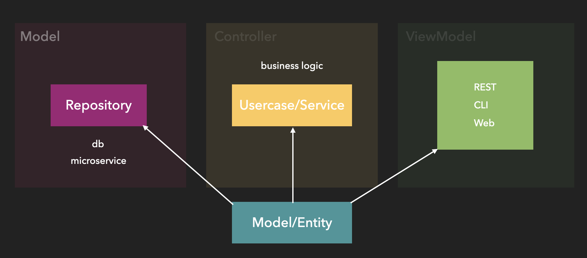
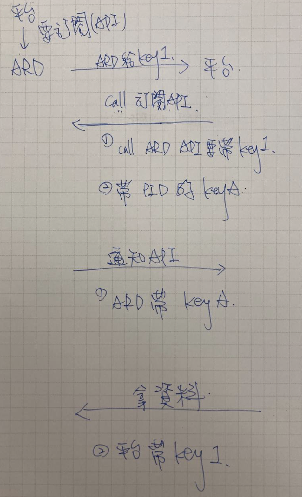
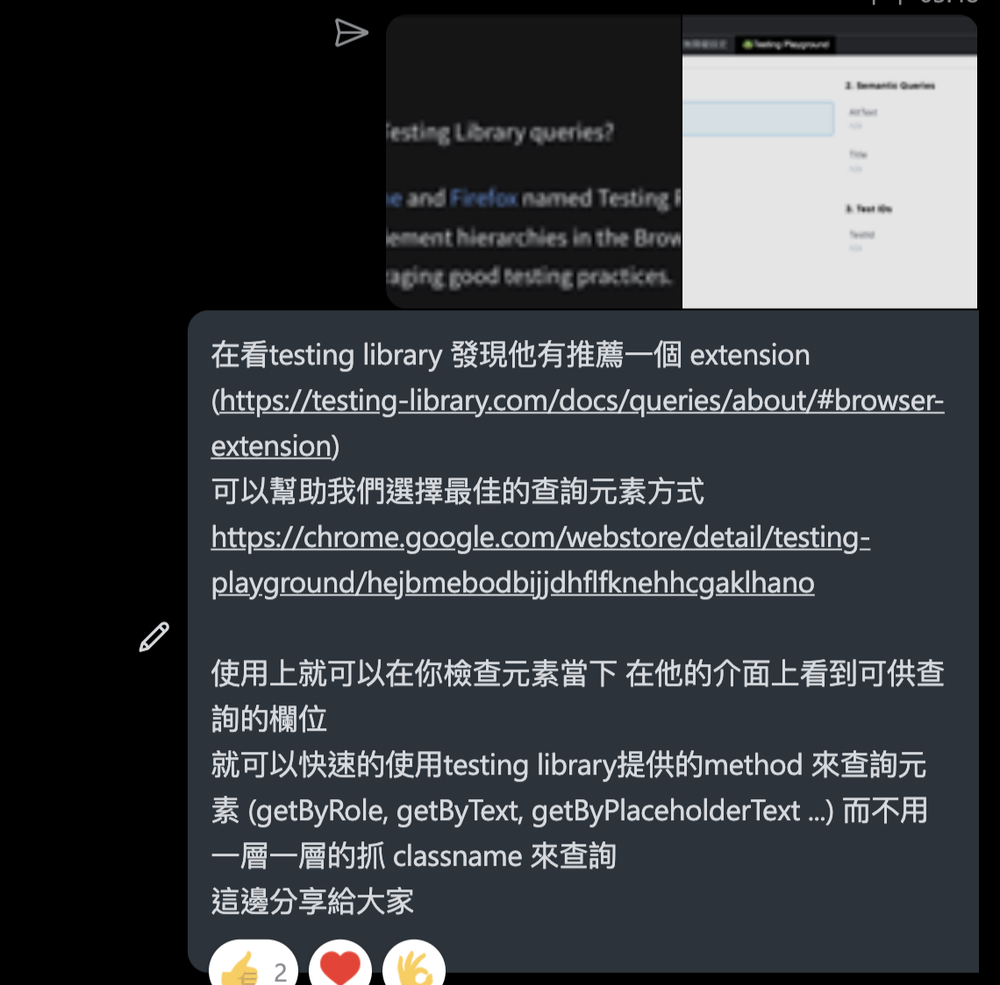

# 2023 技術審查
評議職級: SPD4

[toc]

# Programming - level 3

### 重構 module level
 

|     | Specific  | Number  | Time  | prove |
|  ----  | ----  | ----  | ----  | ----  |
| 獨立網址重建 | 1. 舊有的獨立網址系統架構不適合加入新平台或功能，且程式框架較為複雜，因此重構  2. 使用 React 和 golang 進行系統重構  3. 以訂閱推播的方式推送資料 | 馬拉松 | 2022/09 ~ now |[issue](https://proton.vir000.com/castle/carriage/-/issues/9)|
| 抗劫持  | 原先抗劫持`單一`、`全部`地區的 IP 替換是透過存放在 Redis 資料庫做替換，透過將資料源 切換成 loki 的方式改善`資料保留與查詢不方便`、`檢測結果顯示不完整`、`檢測結果不即時`等問題| 2-3 member |2 sprint|[issue](https://proton.vir000.com/prediction/predictor/-/issues/388)|
|外部抗封鎖| 導轉規則驗證邏輯複雜，且複用性較高，透過模塊的抽離能更好的進行測試 | 1 member | 1 sprint |[code](https://proton.vir000.com/prediction/spiker/-/blob/157fb7f98995174e1d6ed3e96006741147c86e7e/src/Component/Redirection/RedirectionRuleValidation.js)|
 

 

### 必要時能夠與部門進行分享
 

|     | Specific  | Number  | Time  | prove |
|  ----  | ----  | ----  | ----  | ----  |
| Typescript| 1. 較為熱門  2. 前端套件都以 TS 編寫  3. 有實作經驗  | once | 20mis | [TypeScript](https://proton.vir000.com/castle/maid/-/issues/6) |

 

### 能夠獨立完成任務
 

|     | Specific  | Number  | Time  | prove |
|  ----  | ----  | ----  | ----  | ----  |
| 建站管理 | TBI | own | 2021/11~2021/12 | [maid](https://proton.vir000.com/castle/maid/-/merge_requests?scope=all&state=merged&author_username=Jason) |
| 抗封鎖/抗劫持 | TBI | own | 2021/12~2022/10 | [prospect](https://proton.vir000.com/prediction/prospect/-/merge_requests?scope=all&state=merged&author_username=Jason)  [hight five](https://proton.vir000.com/prediction/high-five/-/merge_requests?scope=all&state=merged&author_username=Jason)  [predictor](https://proton.vir000.com/prediction/predictor/-/merge_requests?scope=all&state=merged&author_username=Jason)|
| 一鍵登出 | TBI | own | 2022/05 | [trinity](https://proton.vir000.com/hello/trinity/-/merge_requests?scope=all&state=merged&author_username=Jason) |
| 外部抗封鎖 | TBI | own | 2022/06~2022/12 | [spiker](https://proton.vir000.com/prediction/spiker/-/merge_requests?scope=all&state=merged&author_username=Jason)  [hitter](https://proton.vir000.com/prediction/hitter/-/merge_requests?scope=all&state=merged&author_username=Jason)  [outside spiker](https://proton.vir000.com/prediction/outside-spiker/-/merge_requests?scope=all&state=merged&author_username=Jason)  [outside hitter](https://proton.vir000.com/prediction/outside-hitter/-/merge_requests?scope=all&state=merged&author_username=Jason) |
| 獨立網址 | TBI | own | 2022/07 ~ now | [jockey](https://proton.vir000.com/castle/jockey/-/merge_requests?scope=all&state=merged&author_username=Jason)  [carriage](https://proton.vir000.com/castle/carriage/-/merge_requests?scope=all&state=merged&author_username=Jason) |
| Navigation | 維運 | own | - | [navy-js](https://proton.vir000.com/navigation/navy-js/-/merge_requests?scope=all&state=merged&author_username=Jason) |
| 部署腳本 | 建立專案部署腳本 | own | - | [外部抗封鎖前端專案](https://proton.vir000.com/prediction/prelude/-/merge_requests/378/diffs)  [獨立網址前端專案](https://proton.vir000.com/castle/castle-deploy/-/merge_requests/505/diffs)  [一鍵登出前端專案](https://proton.vir000.com/hello/fallout-deploy/-/merge_requests?scope=all&state=merged&author_username=Jason) |

 

### 了解軟體架構
軟體架構主要是能夠好管理應用程式的邏輯，使應用程式各個區塊間職責更加清晰。
一般會遵循以下基本原則:
1. 分離關注點：將應用程式分離為不同的部分，每個部分負責自己的職責。模型處理數據，視圖展示數據，控制器處理用戶輸入和互動。
2. 低耦合：模型、視圖和控制器之間應該保持低耦合。這樣可以讓每個部分獨立地進行修改和測試。
3. 測試性：分離關注點和低耦合特性可以讓應用程式更容易進行測試。例如，可以單獨測試模型、視圖和控制器，從而確保每個部分的正確性。

 

- 傳統 MVC 架構 View 代表 Html+JS+CSS。
 

- 前後端分離 MVC，View 成為 ViewModel，前端則透過各種框架，有效解耦。
 

- 前端功能逐漸複雜 Model、View、Controller 依賴性過高，難以測試。MVP 有效的解耦 Model 與 Controller 的依賴。
 

- MVVM 模式下 View 完全解耦 Model 和邏輯控制，透過 data binding 機制操作狀態。
 

- Redux 狀態管理機制，提升狀態的可控性
 

- Clean Architecture
 

核心思想是將系統分成多個層次，每個層次都有明確的職責，從而實現高度可測試、可維護和可擴展的系統。

Clean Architecture 通常包括以下幾層：

- 實體層（Entity Layer）：包括系統中的實體類和業務邏輯。

- 用例層（Use Case Layer）：包括系統中的用例類和業務邏輯。

- 介面適配器層（Interface Adapter Layer）：負責將系統中的用例類與外部介面進行映射。

- 框架與驅動層（Framework and Driver Layer）：包括系統中的框架和驅動。

Clean Architecture 運作方式的基本思想是將系統中的各個層次分離開來，每一層都可以獨立地進行開發、測試，而且每一層都只能依賴於下一層，而不能依賴於更下層或者更上層的層次。這樣可以實現系統的低耦合性，從而提高系統的可測試性、可維護性和可擴展性。

 

 
 
 

# Testing - level 3
### 會使用 TDD
 

|     | Specific  | Number  | Time  | prove |
| ---- | ----  | ----  | ----  | ----  |
| 獨立網址 | 1. 先撰寫所有域名規格失敗用例  2. 實作導轉規則驗證程式碼  3. 通過測試 | once  | 1 sprint  | [prove](https://proton.vir000.com/prediction/spiker/-/merge_requests/19/diffs#c3f416414686ec7b4686933ad5bbbeb06c912c07)  |

 

### 熟悉測試框架
- 前端測試框架 Jest
  - Unit test
  - End to End Testing

|     | Specific  | Number  | Time  | prove |
|  ----  | ----  | ----  | ----  | ----  |
| 抗封鎖/抗劫持 | 1. 單元測試  2. End to end 測試  | 20~30 merge request | 1 年 | [end to end](https://proton.vir000.com/prediction/prospect/-/merge_requests/350/diffs#diff-content-60726a73bda3b55469cddacedb6e0bb2bfa565fe)  [unit test](https://proton.vir000.com/prediction/prospect/-/merge_requests/350/diffs#diff-content-63315393c383678f2dc2a8e9ec66439f0ff6ae53) |
| 獨立網址 | End to end 測試  | 30~40 merge request | 5 個月 | [end to end](https://proton.vir000.com/castle/jockey/-/merge_requests/14/diffs#diff-content-b29aef74015d0c4efdd56a6e48ade75b63410dd2) |
| 外部抗封鎖前後台 | 1. 單元測試  2. End to end 測試 | 20~30 merge request | 6 個月 | [end to end](https://proton.vir000.com/prediction/spiker/-/merge_requests/17/diffs#diff-content-3d6eb5ed62b5af193c953bbccf01b27c28db7920)  [unit test](https://proton.vir000.com/prediction/spiker/-/merge_requests/19/diffs#diff-content-31bc43b87ea1475c1f8b8a49a6554e8b299a929f) |

- 後端測試框架 Golang Testify
  - Unit test

|     | Specific  | Number  | Time  | prove |
|  ----  | ----  | ----  | ----  | ----  |
| 抗封鎖/抗劫持 | 單元測試  | 5 merge request | 1 年 | [prospect](https://proton.vir000.com/prediction/high-five/-/merge_requests?scope=all&state=merged&author_username=Jason) |
| 獨立網址 | 單元測試 | 50~60 merge request | 5 個月 | [carriage](https://proton.vir000.com/castle/jockey/-/merge_requests?author_username=Jason&page=3&scope=all&state=merged) |
| 外部抗封鎖 | 單元測試 | 5~10 merge request | 2 個月 | [high-five-external](https://proton.vir000.com/prediction/high-five-external/-/merge_requests?scope=all&state=merged&author_username=Jason) |

 
 
 

# Infrastructure/DevOps - level 3

### 實作監控流程或機制
 

|     | Specific  | Number  | Time  | prove |
| ---- | ----  | ----  | ----  | ----  |
|  監控機制  | 將前端和後端服務掛載本機 docker 並透過，API 實現 error log 告警  | - | - | [Demo](https://proton.vir000.com/Jason/deploy_demo) |

 

### 實作 CI/CD 流程
 

|     | Specific  | Number  | Time  | prove |
| ---- | ----  | ----  | ----  | ----  |
|  frontend  | 前端 ci 運行 test、lint、scan、build 並生成 artifacts | - | - | [Demo](https://proton.vir000.com/Jason/frontend_demo/-/blob/master/.gitlab-ci.yml)  |
|  backend  |  後端 ci 運行 test、lint、scan、build 並生成 artifacts  | - | - | [Demo](https://proton.vir000.com/Jason/backend_demo/-/blob/master/.gitlab-ci.yml) |

 

### 排除系統問題的能力
 

|     | Specific  | Number  | Time  | prove |
| ---- | ----  | ----  | ----  | ----  |
|  Grafana  | loki、prometheus | - | - | [Demo](https://proton.vir000.com/Jason/deploy_demo/-/tree/master/monitor) |

 
 
 

# Domain Knowledge - level 3

### 了解領域知識和部門內討論
 

|     | Specific  | Number  | Time  | prove |
| ---- | ----  | ----  | ----  | ----  |
| 獨立網址 | 舊系統切換並將功能模塊以 Event Storming 拆分，討論程式流程和邏輯 | - | - | [Event Storming](https://app.diagrams.net/#G1YBMYnE5o_LJmbV64sB2EFz_FwLxI5paX)  |
| 抗封鎖外部 | 抗封鎖外部使用中前後台系統的建立討論，並透過 Event Storming 進行流程邏輯梳理 | - | - | [Event Storming](https://app.diagrams.net/#G1XQnkLaQzv_EuoCMN6Q1WocEdZKt5YTpU)  |

 

### 定義問題與 PO 討論
 

|     | Specific  | Number  | Time  | prove |
| ---- | ----  | ----  | ----  | ----  |
|  獨立網址  | 和 PO 討論訂閱機制，Api key 如何實作等等  | - | - |  |
|  獨立網址  | 和 PO 討論 google 登入流程  | - | - | [issue](https://proton.vir000.com/castle/carriage/-/issues/32)  |
|  抗封鎖  | 和 PO 討論 批次更新可能遇到的狀況  | - | - | [issue](https://proton.vir000.com/prediction/high-five/-/issues/71)  |

 
 
 

# Support
 

|     | Specific  | Number  | Time  | prove |
| ---- | ----  | ----  | ----  | ----  |
| 新人導師 | 2022 上半年指導家慶前端技術 | - | - | [counter](https://proton.vir000.com/postman/counter/-/merge_requests/5) |
| 智能導航網 | 參與智能導航網項目 | - | - | [SmartNavigation](https://proton.vir000.com/smart_navigation/smartnavigation) |

 
 
 

# Experience - level 3

|     | Specific  | Number  | Time  | prove |
| ---- | ----  | ----  | ----  | ----  |
|  Android APP - JAVA/Kotlin | 開發 | - | 1-2 年 | - |
|  Android/IOS APP - React Native  | 開發 | - | 2-3 年 | - |
|  Web Application - React  | 開發 | - | 1 年 | - |
|  Web Service - golang  | 開發  | - | 1 年 | - |
 

# Soft

### 持續為產品/流程的改進做出貢獻
 

|     | Specific  | Number  | Time  | prove |
| ---- | ----  | ----  | ----  | ----  |
|  CI Cache 優化  | 專案原本沒有針對 node_module 進行緩存，以至於 CI Job 特別緩慢 | - | - | [merge request](https://proton.vir000.com/prediction/spiker/-/merge_requests/9) |
|  dependencies check  | 前端專案的資源依賴檢查 | - | - | [merge request](https://proton.vir000.com/castle/jockey/-/merge_requests/122) |

 
 

### 能夠負責完整交付，小項目到正式環境 && 在複雜環境中操作，只須少量監管
 

|     | Specific  | Number  | Time  | prove |
| ---- | ----  | ----  | ----  | ----  |
| spiker | 使用 ansible 腳本部署 QA和正式站  | - | - | [spiker](https://proton.vir000.com/prediction/spiker/-/tags) |
| hitter | 使用 ansible 腳本部署 QA和正式站  | -  | - | [hitter](https://proton.vir000.com/prediction/hitter/-/tags) |
| Jockey | 使用 ansible 腳本部署 QA和正式站  | -  | - | [jockey](https://proton.vir000.com/castle/jockey/-/tags) |

 
 

### 獨立管理專案
 

|     | Specific  | Number  | Time  | prove |
| ---- | ----  | ----  | ----  | ----  |
|  Trinity  | 業務邏輯、專案建置、功能開發、問題除錯、測試、部署 | - | now | [trinity](https://proton.vir000.com/hello/trinity) |
|  prospect | 功能開發、問題除錯、測試、部署 | - | now |[prospect](https://proton.vir000.com/prediction/prospect) |
|  Spiker  | 業務邏輯、專案建置、功能開發、問題除錯、測試、部署  | - | now | [spiker](https://proton.vir000.com/prediction/spiker) |
|  Hitter  | 業務邏輯、專案建置、功能開發、問題除錯、測試、部署 | - | now | [hitter](https://proton.vir000.com/prediction/hitter) |
|  Jockey  | 業務邏輯、專案建置、功能開發、問題除錯、測試、部署  | - | now | [jockey](https://proton.vir000.com/castle/jockey) |
|  carriage  | 業務邏輯、專案建置、功能開發、問題除錯、測試、部署  | - | now | [carriage](https://proton.vir000.com/castle/carriage) |

 
 

### 持續學習並分享給團隊成員
 

|     | Specific  | Number  | Time  | prove |
| ---- | ----  | ----  | ----  | ----  |
| 分享工具 | Testing Playground  | - | - |   |
