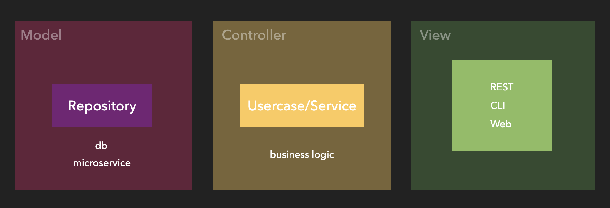

## 技術審查

#### Programming
***
 

### 重構 module level
 

前端

|     | Specific  | Number  | Time  | prove |
|  ----  | ----  | ----  | ----  | ----  |
| 獨立網址| 一般登入替換 google 登入 | 1人 | 1 sprint | [issue](https://proton.vir000.com/castle/carriage/-/issues/32) |
|外部抗封鎖| 導轉規則驗證模塊抽離 | 1人 | 1 sprint |[code](https://proton.vir000.com/prediction/spiker/-/blob/157fb7f98995174e1d6ed3e96006741147c86e7e/src/Component/Redirection/RedirectionRuleValidation.js)|
 

後端
|     | Specific  | Number  | Time  | prove |
|  ----  | ----  | ----  | ----  | ----  |
| 抗劫持  | 重構檢測結果資料來源由 Redis 更換為 Loki | 2-3人 |2 sprint|[issue](https://proton.vir000.com/prediction/predictor/-/issues/388)|
| 獨立網址  | 獨立網址重建 |

***
 

### 必要時能夠與部門進行分享
 

|     | Specific  | Number  | Time  | prove |
|  ----  | ----  | ----  | ----  | ----  |
| Typescript| Typesciprt分享 | 1 次 | 20mis | [TypeScript](https://proton.vir000.com/hello/scrummaster/-/issues/90#note_64471https://proton.vir000.com/Jason/jason_gao/-/blob/master/TypeSctip%E7%B0%A1%E4%BB%8B.md) |

***
 

### 能夠獨立完成任務
 

|     | Specific  | Number  | Time  | prove |
|  ----  | ----  | ----  | ----  | ----  |
| 訂閱推播| 完成獨立網址推播/訂閱功能 | 1人 | 1 sprint | [訂閱推播](https://proton.vir000.com/castle/carriage/-/issues/17) |
| Google 登入 | 完成獨立網址 google 登入和權限控制 | 1人  | 1 sprint | [登入](https://proton.vir000.com/castle/carriage/-/issues/32) |

***
 

### 了解軟體架構
 

- 傳統 MVC
傳統 MVC 架構 View 代表 Html+JS+CSS
 

- 前後端分離 MVC
 

- MVP
 

- MVVM
 

- React + Redux
 

- backend clean architecture
 

## Testing
### 會使用 TDD
 

|     | Specific  | Number  | Time  | prove |
| ---- | ----  | ----  | ----  | ----  |
| frontend |   |   |   | [prove](https://proton.vir000.com/prediction/spiker/-/merge_requests/19/diffs#c3f416414686ec7b4686933ad5bbbeb06c912c07)  |

***
### 熟悉測試框架
前端測試框架 Jest
- Unit test
- End to End Testing

|     | Specific  | Number  | Time  | prove |
|  ----  | ----  | ----  | ----  | ----  |
| 抗封鎖/抗劫持 | 前端`單元測試/End to end`測試  | 20~30 merge request | 1 年 | [prospect](https://proton.vir000.com/prediction/prospect) |
| 獨立網址 | 前端`單元測試/End to end`測試  | 30~40 merge request | 4 個月 | [jockey](https://proton.vir000.com/castle/jockey) |
| 外部抗封鎖前後台 | 前端`單元測試/End to end`測試 | 20~30 merge request | 4 個月 | [spiker](https://proton.vir000.com/prediction/outside-spiker) [hitter](https://proton.vir000.com/prediction/outside-hitter) |

後端測試框架 Golang Testify
- Unit test

|     | Specific  | Number  | Time  | prove |
|  ----  | ----  | ----  | ----  | ----  |
| 獨立網址 | 後端單元測試 | 50~60 merge request | 4 個月 | [carriage](https://proton.vir000.com/castle/carriage) |
| 外部抗封鎖 | 後端單元測試 | 5~10 merge request | 4 個月 | [high-five-external](https://proton.vir000.com/prediction/high-five-external) |

***
### Infrastructure/DevOps
## 實作監控流程或機制
 

|     | Specific  | Number  | Time  | prove |
| ---- | ----  | ----  | ----  | ----  |
|  監控機制  |   |   |   | [Demo](https://proton.vir000.com/Jason/deploy_demo) |

## 排除系統問題的能力
 

|     | Specific  | Number  | Time  | prove |
| ---- | ----  | ----  | ----  | ----  |
|  Grafana  |   |   |   |  |
|  frontEnd  |   |   |   |  |
|  backend  |   |   |   |  |

## 實作 CI/CD 流程
 

|     | Specific  | Number  | Time  | prove |
| ---- | ----  | ----  | ----  | ----  |
|  frontEnd  |   |   |   | [Demo](https://proton.vir000.com/Jason/frontend_demo)  |
|  backend  |   |   |   | [Demo](https://proton.vir000.com/Jason/backend_demo) |

***
## Domain Knowledge
 

### 了解領域知識和部門內討論
 

|     | Specific  | Number  | Time  | prove |
| ---- | ----  | ----  | ----  | ----  |
|    |   |   |   |   |

### 定義問題與 PO 討論
 

|     | Specific  | Number  | Time  | prove |
| ---- | ----  | ----  | ----  | ----  |
|    |   |   |   |   |
***

## Support
 

### 能夠獨立解決50%的問題，並對客戶做出正確的回應
 

|     | Specific  | Number  | Time  | prove |
| ---- | ----  | ----  | ----  | ----  |
|    |   |   |   |   |

## Experience
 

|     | Specific  | Number  | Time  | prove |
| ---- | ----  | ----  | ----  | ----  |
|  APP  |   |   |   |   |
|  Js  |   |   |   |   |
|  golang  |   |   |   |   |

***
## Soft
 

### 能夠發現問題,分析複雜問題的解決方案

### 持續為產品/流程的改進做出貢獻

### 能夠負責完整交付，小項目到正式環境

### 獨立管理專案

### 在複雜環境中操作,只須少量監管

### 持續學習並分享給團隊成員
